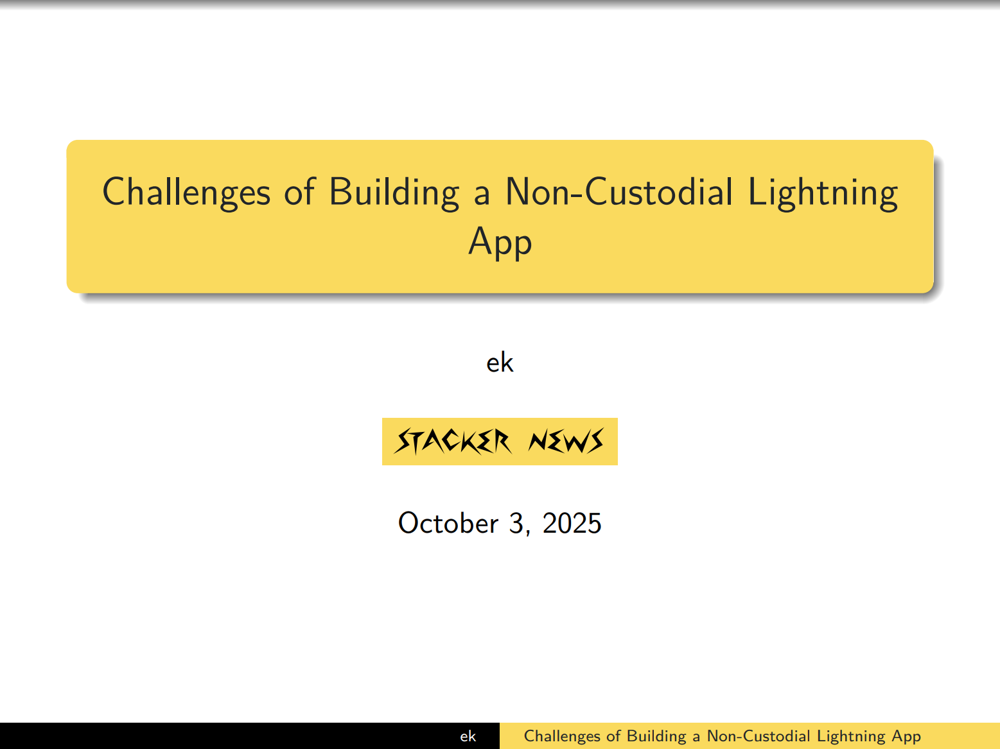

This folder includes the slides for the talk at lightning++ by [@ek](https://stacker.news/ek) in Berlin 2025:

[Challenges of Building a Non-Custodial Lightning App](slides.pdf)

**Development**

See Makefile for how to generate new slides after changes.

**Useful links**

- https://pandoc.org/MANUAL.html
- https://ashwinschronicles.github.io/beamer-slides-using-markdown-and-pandoc
- https://www.cpt.univ-mrs.fr/~masson/latex/Beamer-appearance-cheat-sheet.pdf
